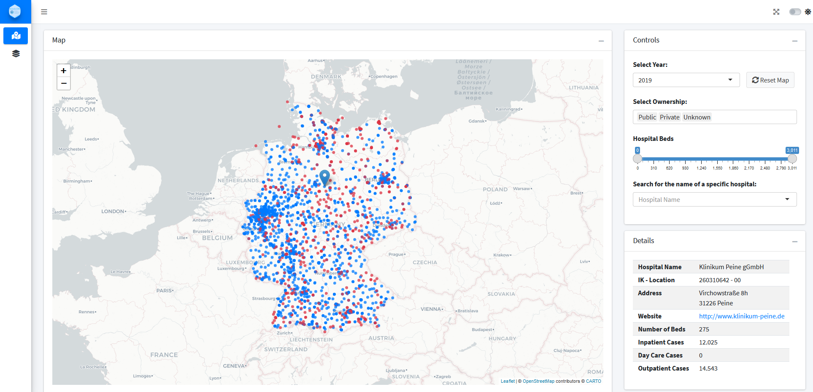

<!-- README.md is generated from README.Rmd. Please edit that file -->

# qbgbaApp 

<!-- badges: start -->

[](https://lifecycle.r-lib.org/articles/stages.html#experimental)
<!-- badges: end -->

The goal of qbgbaApp is the analysis of data from the yearly reports of
German hospitals as published by the “Gemeinsamer Bundesausschuss”
(GBA).

## Installation

You can install the released version of qbgbaApp from
[Gitlab](https://gitlab.com/klinik-db/qbgbaApp) with:

``` r
remotes::install_.packages_gitlab("qbgbaApp")
```

## Run it

It a `golem`-based shiny app, therefore, you can just start it (if
`shiny` is installed):

``` r
qbgbaApp::run_app()
```



## Funding

<a href='https://klinik-db.de'></a>

Sponsored through the Prototype Fund by the German Federal Ministry of
Education and Research from March 2021 to August 2021.
